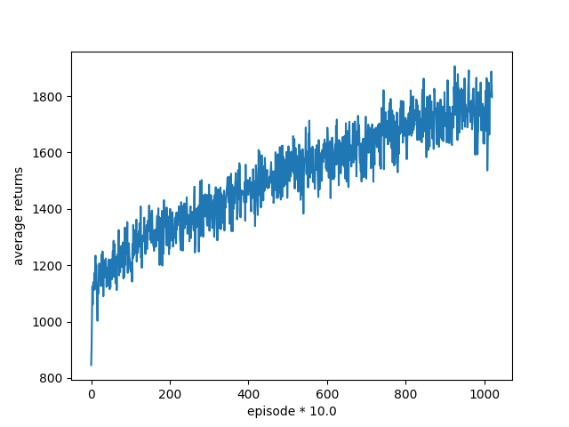
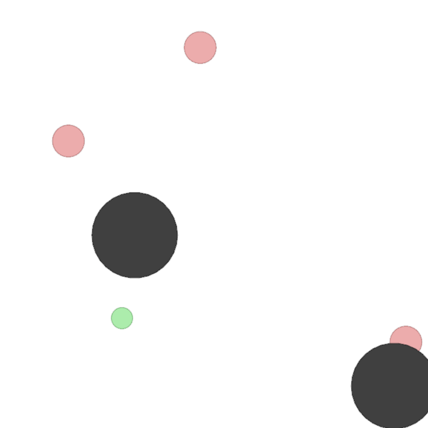

*Each one has his or her own modification, which means it will be not perfectly match MADDPG in the paper.*

In the following, we take **predator-prey (simple_tag)** as a case study.

1. Starry-sky：

   1. Advantage: 

      1. the most **neatest** one.
      2. Thus, it is **easiest** one to understand the implement and pseudo-algorithm of MADDPG.

   2. Disadvantage:

      1. For competitive games:

         1. adversaries only play the simple random policy, like:

            ```python
            actions.append([0, np.random.rand() * 2 - 1, 0, np.random.rand() * 2 - 1, 0])
            ```

         2. **NOTICE! The setting, like # adversaries, are not linked to MPE .....**

            1. eg: even if you set # adversaries =1, and run the "simple_tag"
               1. the # adversaries is still 3

         3. **NOTICE! Different setting for the good agent (that we can control) and adversaries:**

            - In MPE: agents = (adversary_1, .... , adversary_{#adversary},  good agent_1, ... , good agent{env.n - # adversary})：

              - if we check: here we use "simple_tag"

              - ```python
                    for i in range(env.n):
                        print(env.agents[i].adversary)
                ```

                - Then the answer will: True, True, True, False
                - which means the last one is agent we want to control...

            - However, in sky's code, the order is reverse

              ```python
              with torch.no_grad():
                for agent_id, agent in enumerate(self.agents):
                  action = agent.select_action(s[agent_id], 0, 0)
                  actions.append(action)
                  for i in range(self.args.n_agents, self.args.n_players):
                      actions.append([0, np.random.rand() * 2 - 1, 0, np.random.rand() * 2 - 1, 0])
              ```

            - The result for: There are 4 agents in simple_tag, including 3 predators and 1 prey. we use MADDPG to train predators to catch the prey. The prey's action can be controlled by you, in our case we set it random. 

            

         4. Low efficiency......

         5. Different network structure  for actor and critic.... See more by comparing this with openai's model

         6. Different evaluate method

2. Xuehy: 

   1. Advantage: easy to read
   2. Applied to MADRL instead of MPE.
   3. **ONLY** focus on cooperative games. More specifically, it is designed for the **waterworld** game based on MADRL

3. Shari:

   1. Install TIPS:

      1. must install the env listed in his repo
      2. must install gym 0.9.4

   2. Advantages: the most **complete** one. (however, still not perfectly matching MADDPG)

   3. Disadvantages:

      1. Diff actor, diff weight sharing
      2. Not implemented:
         1. Ensemble Training
         2. Inferring other agents' policies
         3. Mixed continuous/discrete action spaces

      

      Reproduce the simple_tag/ predatro-pre result:

      
